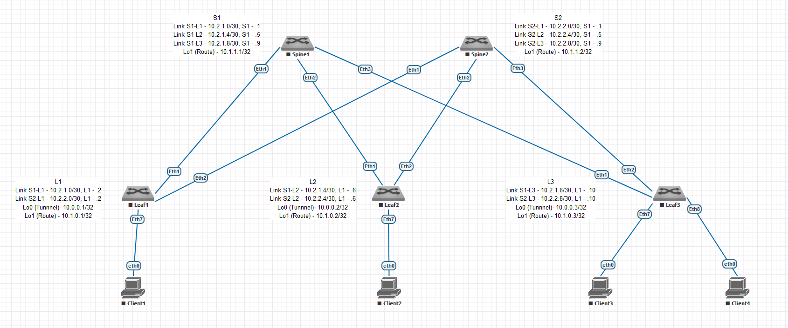

# Домашнее задание 2 (Урок 5)

Для выполнения ДЗ необходимо
- составить план выполнения настройки
- создать конфигурации
- произвести проверку на лабораторном стенде
Выполнение задание сконцентрировано на настройке OSPF, полагаем что ip адресация и интерфейсы уже настроены в ДЗ1 (Урок 3).

## 1. План настройки типичный для OSPF конфигураций.

### 1.1. активация router ospf
### 1.2. настройка параметров работы router (router-id, passive-interface, network, area, bfd)
### 1.3. настройка интерфейсов

Схема из ДЗ1 на основе которой производилась настройка




## 2. Конфигурации, добавляемые в рамках данного ДЗ (остальное взято из ДЗ1)

=== Leaf1

```
interface Ethernet1
 ip ospf network point-to-point
!
interface Ethernet2
 ip ospf network point-to-point

ip routing
!
router ospf 1
   router-id 10.1.0.1
   passive-interface default
   no passive-interface Ethernet1
   no passive-interface Ethernet2
   network 0.0.0.0/0 area 0.0.0.0
   bfd default
```

=== Leaf2

```
interface Ethernet1
 ip ospf network point-to-point
!
interface Ethernet2
 ip ospf network point-to-point

ip routing
!
router ospf 1
   router-id 10.1.0.2
   passive-interface default
   no passive-interface Ethernet1
   no passive-interface Ethernet2
   network 0.0.0.0/0 area 0.0.0.0
   bfd default
```

=== Leaf3

```
interface Ethernet1
 ip ospf network point-to-point
!
interface Ethernet2
 ip ospf network point-to-point

ip routing
!
router ospf 1
   router-id 10.1.0.3
   passive-interface default
   no passive-interface Ethernet1
   no passive-interface Ethernet2
   network 0.0.0.0/0 area 0.0.0.0
   bfd default
```

=== Spine1

```
interface Ethernet1
 ip ospf network point-to-point
!
interface Ethernet2
 ip ospf network point-to-point
!
interface Ethernet3
 ip ospf network point-to-point

ip routing
!
router ospf 1
   router-id 10.1.1.1
   passive-interface default
   no passive-interface Ethernet1
   no passive-interface Ethernet2
   no passive-interface Ethernet3
   network 0.0.0.0/0 area 0.0.0.0
   bfd default
```

=== Spine2

```
interface Ethernet1
 ip ospf network point-to-point
!
interface Ethernet2
 ip ospf network point-to-point
!
interface Ethernet3
 ip ospf network point-to-point

ip routing
!
router ospf 1
   router-id 10.1.1.2
   passive-interface default
   no passive-interface Ethernet1
   no passive-interface Ethernet2
   no passive-interface Ethernet3
   network 0.0.0.0/0 area 0.0.0.0
   bfd default
```

### 3. Проверка работы

Для примера выполняется с помощью ping, traceroute между Leaf3 Lo1 (10.1.0.3) - Leaf1 Lo1 (10.1.0.1)

~~~
leaf3#sh ip ospf neighbor
Neighbor ID     Instance VRF      Pri State                  Dead Time   Address         Interface
10.1.1.1        1        default  0   FULL                   00:00:31    10.2.1.9        Ethernet1
10.1.1.2        1        default  0   FULL                   00:00:38    10.2.2.9        Ethernet2

leaf3#sh bfd peers
VRF name: default
-----------------
DstAddr       MyDisc    YourDisc  Interface/Transport    Type           LastUp
--------- ----------- ----------- -------------------- ------- ----------------
10.2.1.9   186541373  3111832184        Ethernet1(15)  normal   05/19/24 14:41
10.2.2.9  2074272583  1168463123        Ethernet2(16)  normal   05/19/24 14:39

   LastDown            LastDiag    State
-------------- ------------------- -----
         NA       No Diagnostic       Up
         NA       No Diagnostic       Up

leaf3#sh ip ro 10.1.0.1

VRF: default
Codes: C - connected, S - static, K - kernel,
       O - OSPF, IA - OSPF inter area, E1 - OSPF external type 1,
       E2 - OSPF external type 2, N1 - OSPF NSSA external type 1,
       N2 - OSPF NSSA external type2, B - Other BGP Routes,
       B I - iBGP, B E - eBGP, R - RIP, I L1 - IS-IS level 1,
       I L2 - IS-IS level 2, O3 - OSPFv3, A B - BGP Aggregate,
       A O - OSPF Summary, NG - Nexthop Group Static Route,
       V - VXLAN Control Service, M - Martian,
       DH - DHCP client installed default route,
       DP - Dynamic Policy Route, L - VRF Leaked,
       G  - gRIBI, RC - Route Cache Route

 O        10.1.0.1/32 [110/30] via 10.2.1.9, Ethernet1
                               via 10.2.2.9, Ethernet2


leaf3#ping 10.1.0.1 source 10.1.0.3
PING 10.1.0.1 (10.1.0.1) from 10.1.0.3 : 72(100) bytes of data.
80 bytes from 10.1.0.1: icmp_seq=1 ttl=63 time=50.5 ms
80 bytes from 10.1.0.1: icmp_seq=2 ttl=63 time=42.8 ms
80 bytes from 10.1.0.1: icmp_seq=3 ttl=63 time=37.3 ms
80 bytes from 10.1.0.1: icmp_seq=4 ttl=63 time=34.3 ms
80 bytes from 10.1.0.1: icmp_seq=5 ttl=63 time=29.4 ms

--- 10.1.0.1 ping statistics ---
5 packets transmitted, 5 received, 0% packet loss, time 45ms
rtt min/avg/max/mdev = 29.481/38.925/50.596/7.267 ms, pipe 5, ipg/ewma 11.481/44.264 ms

leaf3#trace 10.1.0.1 source 10.1.0.3
traceroute to 10.1.0.1 (10.1.0.1), 30 hops max, 60 byte packets
 1  10.2.1.9 (10.2.1.9)  18.946 ms  18.928 ms  29.203 ms
 2  10.1.0.1 (10.1.0.1)  49.303 ms  53.697 ms  63.201 ms
~~~
