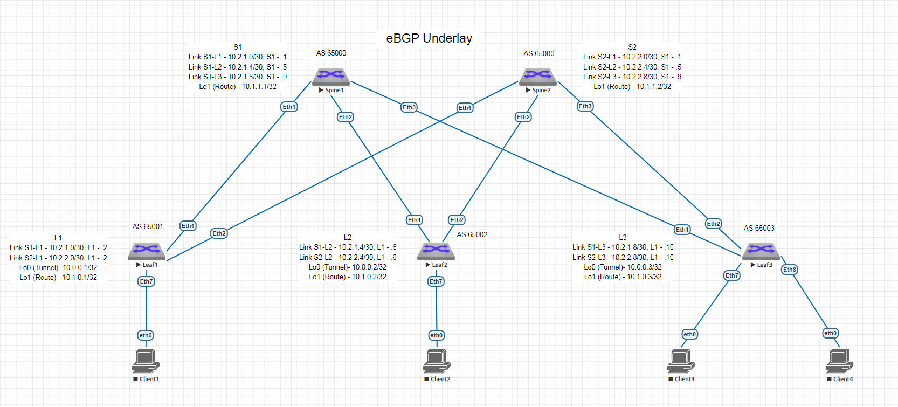

# Домашнее задание 4 (Урок 8)

Для выполнения ДЗ необходимо
- составить план выполнения настройки
- создать конфигурации
- произвести проверку на лабораторном стенде

Выполнение задания сконцентрировано на настройке BGP, полагаем что ip адресация и интерфейсы уже настроены в ДЗ1 (Урок 3).

## 1. План настройки типичный для BGP конфигураций.

### 1.1. активация router bgp
### 1.2. настройка параметров работы router (neighbor, redistribute, bfd)
### 1.3. настройка интерфейсов

Схема из ДЗ1 на основе которой производилась настройка




## 2. Конфигурации, добавляемые в рамках данного ДЗ (остальное взято из ДЗ1)

=== Leaf1 10.1.0.1

```
router isis underlay
 net 49.0001.0100.0100.0001.00
 is-type level-2
!
 address-family ipv4 unicast
 passive ethernet 1-8
 passive loopback 0-1


interface Ethernet1
 isis enable underlay
 isis bfd
 no isis passive
!
interface Ethernet2
 isis enable underlay
 isis bfd
 no isis passive
```

=== Leaf2 10.1.0.2

```
router isis underlay
 net 49.0001.0100.0100.0002.00
 is-type level-2
!
 address-family ipv4 unicast
 passive ethernet 1-8
 passive loopback 0-1

interface Ethernet1
 isis enable underlay
 isis bfd
 no isis passive
!
interface Ethernet2
 isis enable underlay
 isis bfd
 no isis passive
```

=== Leaf3 10.1.0.3

```
router isis underlay
 net 49.0001.0100.0100.0003.00
 is-type level-2
!
 address-family ipv4 unicast
 passive ethernet 1-8
 passive loopback 0-1

interface Ethernet1
 isis enable underlay
 isis bfd
 no isis passive
!
interface Ethernet2
 isis enable underlay
 isis bfd
 no isis passive
```

=== Spine1 10.1.1.1

```
router isis underlay
 net 49.0001.0100.0100.1001.00
 is-type level-2
 !
 address-family ipv4 unicast
 passive ethernet 1-8
 passive loopback 1

interface Ethernet1
 isis enable underlay
 isis bfd
 no isis passive
!
interface Ethernet2
 isis enable underlay
 isis bfd
 no isis passive
!
interface Ethernet3
 isis enable underlay
 isis bfd
 no isis passive
```

=== Spine2 10.1.1.2

```
router isis underlay
 net 49.0001.0100.0100.1002.00
 is-type level-2
 !
 address-family ipv4 unicast
 passive ethernet 1-8
 passive loopback 1

interface Ethernet1
 isis enable underlay
 isis bfd
 no isis passive
!
interface Ethernet2
 isis enable underlay
 isis bfd
 no isis passive
!
interface Ethernet3
 isis enable underlay
 isis bfd
 no isis passive
```

### 3. Проверка работы

Выполняется с помощью ping, traceroute между Leaf3 Lo1 (10.1.0.3) - Leaf1 Lo1 (10.1.0.1)

~~~
leaf1#show isis neighbors
Instance  VRF      System Id        Type Interface          SNPA              State Hold time   Circuit Id
underlay  default  spine1           L2   Ethernet1          50:0:0:d7:ee:b    UP    7           spine1.0d
underlay  default  spine2           L2   Ethernet2          50:0:0:cb:38:c2   UP    29          leaf1.0e

spine1#show isis neighbors
Instance  VRF      System Id        Type Interface          SNPA              State Hold time   Circuit Id
underlay  default  leaf1            L2   Ethernet1          50:0:0:d5:5d:c0   UP    27          spine1.0d
underlay  default  leaf2            L2   Ethernet2          50:0:0:3:37:66    UP    23          spine1.0e
underlay  default  leaf3            L2   Ethernet3          50:0:0:15:f4:e8   UP    22          spine1.0f

leaf3#sh isis neighbors
Instance  VRF      System Id        Type Interface          SNPA              State Hold time   Circuit Id
underlay  default  spine1           L2   Ethernet1          50:0:0:d7:ee:b    UP    9           spine1.0f
underlay  default  spine2           L2   Ethernet2          50:0:0:cb:38:c2   UP    8           spine2.0f


leaf3#sh isis hostname

IS-IS Instance: underlay VRF: default
Level  System ID           Hostname
L2     0100.0100.0001      leaf1
L2     0100.0100.0002      leaf2
L2     0100.0100.0003      leaf3
L2     0100.0100.1001      spine1
L2     0100.0100.1002      spine2


leaf3#sh bfd peers
VRF name: default
-----------------
DstAddr       MyDisc    YourDisc  Interface/Transport    Type           LastUp
--------- ----------- ----------- -------------------- ------- ----------------
10.2.1.9  2785038550  3041426180        Ethernet1(13)  normal   06/04/24 21:06
10.2.2.9  1837980708  2887162523        Ethernet2(14)  normal   06/04/24 21:07

   LastDown            LastDiag    State
-------------- ------------------- -----
         NA       No Diagnostic       Up
         NA       No Diagnostic       Up


leaf3#sh ip route

VRF: default
Codes: C - connected, S - static, K - kernel,
       O - OSPF, IA - OSPF inter area, E1 - OSPF external type 1,
       E2 - OSPF external type 2, N1 - OSPF NSSA external type 1,
       N2 - OSPF NSSA external type2, B - Other BGP Routes,
       B I - iBGP, B E - eBGP, R - RIP, I L1 - IS-IS level 1,
       I L2 - IS-IS level 2, O3 - OSPFv3, A B - BGP Aggregate,
       A O - OSPF Summary, NG - Nexthop Group Static Route,
       V - VXLAN Control Service, M - Martian,
       DH - DHCP client installed default route,
       DP - Dynamic Policy Route, L - VRF Leaked,
       G  - gRIBI, RC - Route Cache Route

Gateway of last resort is not set

 I L2     10.0.0.1/32 [115/30] via 10.2.1.9, Ethernet1
                               via 10.2.2.9, Ethernet2
 I L2     10.0.0.2/32 [115/30] via 10.2.1.9, Ethernet1
                               via 10.2.2.9, Ethernet2
 C        10.0.0.3/32 is directly connected, Loopback0
 I L2     10.1.0.1/32 [115/30] via 10.2.1.9, Ethernet1
                               via 10.2.2.9, Ethernet2
 I L2     10.1.0.2/32 [115/30] via 10.2.1.9, Ethernet1
                               via 10.2.2.9, Ethernet2
 C        10.1.0.3/32 is directly connected, Loopback1
 I L2     10.1.1.1/32 [115/20] via 10.2.1.9, Ethernet1
 I L2     10.1.1.2/32 [115/20] via 10.2.2.9, Ethernet2
 I L2     10.2.1.0/30 [115/20] via 10.2.1.9, Ethernet1
 I L2     10.2.1.4/30 [115/20] via 10.2.1.9, Ethernet1
 C        10.2.1.8/30 is directly connected, Ethernet1
 I L2     10.2.2.0/30 [115/20] via 10.2.2.9, Ethernet2
 I L2     10.2.2.4/30 [115/20] via 10.2.2.9, Ethernet2
 C        10.2.2.8/30 is directly connected, Ethernet2


leaf3#sh ip ro 10.1.0.1

VRF: default
Codes: C - connected, S - static, K - kernel,
       O - OSPF, IA - OSPF inter area, E1 - OSPF external type 1,
       E2 - OSPF external type 2, N1 - OSPF NSSA external type 1,
       N2 - OSPF NSSA external type2, B - Other BGP Routes,
       B I - iBGP, B E - eBGP, R - RIP, I L1 - IS-IS level 1,
       I L2 - IS-IS level 2, O3 - OSPFv3, A B - BGP Aggregate,
       A O - OSPF Summary, NG - Nexthop Group Static Route,
       V - VXLAN Control Service, M - Martian,
       DH - DHCP client installed default route,
       DP - Dynamic Policy Route, L - VRF Leaked,
       G  - gRIBI, RC - Route Cache Route

 I L2     10.1.0.1/32 [115/30] via 10.2.1.9, Ethernet1
                               via 10.2.2.9, Ethernet2


leaf3#ping 10.1.0.1 source 10.1.0.3
PING 10.1.0.1 (10.1.0.1) from 10.1.0.3 : 72(100) bytes of data.
80 bytes from 10.1.0.1: icmp_seq=1 ttl=63 time=25.5 ms
80 bytes from 10.1.0.1: icmp_seq=2 ttl=63 time=20.9 ms
80 bytes from 10.1.0.1: icmp_seq=3 ttl=63 time=12.4 ms
80 bytes from 10.1.0.1: icmp_seq=4 ttl=63 time=16.8 ms
80 bytes from 10.1.0.1: icmp_seq=5 ttl=63 time=13.2 ms

--- 10.1.0.1 ping statistics ---
5 packets transmitted, 5 received, 0% packet loss, time 85ms
rtt min/avg/max/mdev = 12.408/17.802/25.571/4.923 ms, pipe 2, ipg/ewma 21.430/21.428 ms


leaf3#trace 10.1.0.1 source 10.1.0.3
traceroute to 10.1.0.1 (10.1.0.1), 30 hops max, 60 byte packets
 1  10.2.1.9 (10.2.1.9)  39.163 ms  32.304 ms  39.753 ms
 2  10.1.0.1 (10.1.0.1)  45.778 ms  53.191 ms  58.206 ms

~~~
