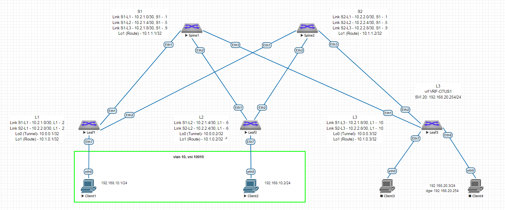

# Домашнее задание 5 (Урок 11)

Для выполнения ДЗ необходимо
- составить план выполнения настройки
- создать конфигурации
- произвести проверку на лабораторном стенде

Выполнение задания сконцентрировано на настройке L2VPN VXLAN, полагаем что ip адресация и интерфейсы уже настроены в ДЗ1 (Урок 3).
Выбран OSPF Underlay из ДЗ2 (Урок 5).
Выбран eBGP EVPN Overlay (Урок 8).

## 1. План настройки:

### 1.1. настройка на Leaf локальных параметров - vlan, interface для подключения конечных клиентских машин
### 1.2. настройка локальных параметров конечных клиентских машин
### 1.3. активация vxlan интерфейса
### 1.4. активация router bgp (соответственно с разными номерами AS для eBGP)
### 1.5. настройка параметров работы router bgp на Leaf, Spine (router-id, peer-group, timers, neighbor, bfd, address-family и т.д.)
### 1.5. настройка параметров работы router bgp на Leaf для MACVRF (vlan, rd, rt)

Схема на основе которой производилась настройка



## 2. Конфигурации, добавляемые в рамках данного ДЗ (остальное взято из ДЗ1)

Для корректной работы команды redistribute в router bgp при настройке Arista EOS в современных версиях нужны команды:

```
service routing protocols model multi-agent
write
reload
```

Выполнено для всех устройств в схеме (Leaf1-3, Spine1-2).

=== Leaf1 10.1.0.1

```
vlan 10
!
interface Ethernet7
   switchport mode access
   switchport access vlan 10
   no shutdown
!
interface Vxlan1
   vxlan source-interface Loopback0
   vxlan udp-port 4789
   vxlan vlan 10 vni 10010
!
router bgp 65001
   router-id 10.1.0.1
   timers bgp 3 9
   maximum-paths 8
   neighbor PG-SPINE peer group
   neighbor PG-SPINE remote-as 65000
   neighbor PG-SPINE update-source 10.1.0.1
   neighbor PG-SPINE bfd
   neighbor PG-SPINE ebgp-multihop
   neighbor PG-SPINE send-community extended
   neighbor 10.1.1.1 peer group PG-SPINE
   neighbor 10.1.1.2 peer group PG-SPINE
   !
   vlan 10
      rd auto
      route-target both 10:10010
      redistribute learned
   !
   address-family evpn
      neighbor PG-SPINE activate
```

=== Leaf2 10.1.0.2

```
router bgp 65002
   router-id 10.1.0.2
   timers bgp 3 9
   maximum-paths 8
   neighbor PG-SPINE peer group
   neighbor PG-SPINE remote-as 65000
   neighbor PG-SPINE bfd
   neighbor 10.2.1.5 peer group PG-SPINE
   neighbor 10.2.2.5 peer group PG-SPINE
   !
   address-family ipv4
      redistribute connected
```

=== Leaf3 10.1.0.3

```
router bgp 65003
   router-id 10.1.0.3
   timers bgp 3 9
   maximum-paths 8
   neighbor PG-SPINE peer group
   neighbor PG-SPINE remote-as 65000
   neighbor PG-SPINE bfd
   neighbor 10.2.1.9 peer group PG-SPINE
   neighbor 10.2.2.9 peer group PG-SPINE
   !
   address-family ipv4
      redistribute connected
```

=== Spine1 10.1.1.1

```
router bgp 65000
   router-id 10.1.1.1
   timers bgp 3 9
   maximum-paths 8
   neighbor PG-LEAF peer group
   neighbor PG-LEAF bfd
   neighbor 10.2.1.2 peer group PG-LEAF
   neighbor 10.2.1.2 remote-as 65001
   neighbor 10.2.1.6 peer group PG-LEAF
   neighbor 10.2.1.6 remote-as 65002
   neighbor 10.2.1.10 peer group PG-LEAF
   neighbor 10.2.1.10 remote-as 65003
   !
   address-family ipv4
      redistribute connected
```

=== Spine2 10.1.1.2

```
router bgp 65000
   router-id 10.1.1.2
   timers bgp 3 9
   maximum-paths 8
   neighbor PG-LEAF peer group
   neighbor PG-LEAF bfd
   neighbor 10.2.2.2 peer group PG-LEAF
   neighbor 10.2.2.2 remote-as 65001
   neighbor 10.2.2.6 peer group PG-LEAF
   neighbor 10.2.2.6 remote-as 65002
   neighbor 10.2.2.10 peer group PG-LEAF
   neighbor 10.2.2.10 remote-as 65003
   !
   address-family ipv4
      redistribute connected
```

### 3. Проверка работы

Выполняется с помощью ping, traceroute между Leaf3 Lo1 (10.1.0.3) - Leaf1 Lo1 (10.1.0.1)

~~~
leaf1#sh ip bgp summary
BGP summary information for VRF default
Router identifier 10.1.0.1, local AS number 65001
Neighbor Status Codes: m - Under maintenance
  Neighbor V AS           MsgRcvd   MsgSent  InQ OutQ  Up/Down State   PfxRcd PfxAcc
  10.2.1.1 4 65000            301       304    0    0 00:12:31 Estab   10     10
  10.2.2.1 4 65000            299       301    0    0 00:12:31 Estab   10     10

spine1#sh ip bgp summary
BGP summary information for VRF default
Router identifier 10.1.1.1, local AS number 65000
Neighbor Status Codes: m - Under maintenance
  Neighbor  V AS           MsgRcvd   MsgSent  InQ OutQ  Up/Down State   PfxRcd PfxAcc
  10.2.1.2  4 65001            314       310    0    0 00:12:57 Estab   4      4
  10.2.1.6  4 65002            308       307    0    0 00:12:57 Estab   4      4
  10.2.1.10 4 65003            310       311    0    0 00:12:54 Estab   4      4


leaf1#sh bfd peers
VRF name: default
-----------------
DstAddr       MyDisc    YourDisc  Interface/Transport    Type           LastUp
--------- ----------- ----------- -------------------- ------- ----------------
10.2.1.1  3412729397  1780373922        Ethernet1(15)  normal   06/13/24 18:34
10.2.2.1  2603115634  1441647632        Ethernet2(16)  normal   06/13/24 18:34

   LastDown            LastDiag    State
-------------- ------------------- -----
         NA       No Diagnostic       Up
         NA       No Diagnostic       Up


leaf3#sh ip route

VRF: default
Codes: C - connected, S - static, K - kernel,
       O - OSPF, IA - OSPF inter area, E1 - OSPF external type 1,
       E2 - OSPF external type 2, N1 - OSPF NSSA external type 1,
       N2 - OSPF NSSA external type2, B - Other BGP Routes,
       B I - iBGP, B E - eBGP, R - RIP, I L1 - IS-IS level 1,
       I L2 - IS-IS level 2, O3 - OSPFv3, A B - BGP Aggregate,
       A O - OSPF Summary, NG - Nexthop Group Static Route,
       V - VXLAN Control Service, M - Martian,
       DH - DHCP client installed default route,
       DP - Dynamic Policy Route, L - VRF Leaked,
       G  - gRIBI, RC - Route Cache Route

Gateway of last resort is not set

 B E      10.0.0.1/32 [200/0] via 10.2.1.9, Ethernet1
                              via 10.2.2.9, Ethernet2
 B E      10.0.0.2/32 [200/0] via 10.2.1.9, Ethernet1
                              via 10.2.2.9, Ethernet2
 C        10.0.0.3/32 is directly connected, Loopback0
 B E      10.1.0.1/32 [200/0] via 10.2.1.9, Ethernet1
                              via 10.2.2.9, Ethernet2
 B E      10.1.0.2/32 [200/0] via 10.2.1.9, Ethernet1
                              via 10.2.2.9, Ethernet2
 C        10.1.0.3/32 is directly connected, Loopback1
 B E      10.1.1.1/32 [200/0] via 10.2.1.9, Ethernet1
 B E      10.1.1.2/32 [200/0] via 10.2.2.9, Ethernet2
 B E      10.2.1.0/30 [200/0] via 10.2.1.9, Ethernet1
 B E      10.2.1.4/30 [200/0] via 10.2.1.9, Ethernet1
 C        10.2.1.8/30 is directly connected, Ethernet1
 B E      10.2.2.0/30 [200/0] via 10.2.2.9, Ethernet2
 B E      10.2.2.4/30 [200/0] via 10.2.2.9, Ethernet2
 C        10.2.2.8/30 is directly connected, Ethernet2

leaf3#sh ip route 10.1.0.1

VRF: default
Codes: C - connected, S - static, K - kernel,
       O - OSPF, IA - OSPF inter area, E1 - OSPF external type 1,
       E2 - OSPF external type 2, N1 - OSPF NSSA external type 1,
       N2 - OSPF NSSA external type2, B - Other BGP Routes,
       B I - iBGP, B E - eBGP, R - RIP, I L1 - IS-IS level 1,
       I L2 - IS-IS level 2, O3 - OSPFv3, A B - BGP Aggregate,
       A O - OSPF Summary, NG - Nexthop Group Static Route,
       V - VXLAN Control Service, M - Martian,
       DH - DHCP client installed default route,
       DP - Dynamic Policy Route, L - VRF Leaked,
       G  - gRIBI, RC - Route Cache Route

 B E      10.1.0.1/32 [200/0] via 10.2.1.9, Ethernet1
                              via 10.2.2.9, Ethernet2


leaf3#ping 10.1.0.1 source 10.1.0.3
PING 10.1.0.1 (10.1.0.1) from 10.1.0.3 : 72(100) bytes of data.
80 bytes from 10.1.0.1: icmp_seq=1 ttl=63 time=13.6 ms
80 bytes from 10.1.0.1: icmp_seq=2 ttl=63 time=12.3 ms
80 bytes from 10.1.0.1: icmp_seq=3 ttl=63 time=12.0 ms
80 bytes from 10.1.0.1: icmp_seq=4 ttl=63 time=17.6 ms
80 bytes from 10.1.0.1: icmp_seq=5 ttl=63 time=20.5 ms

--- 10.1.0.1 ping statistics ---
5 packets transmitted, 5 received, 0% packet loss, time 59ms
rtt min/avg/max/mdev = 12.090/15.262/20.560/3.307 ms, pipe 2, ipg/ewma 14.980/14.699 ms


leaf3#trace 10.1.0.1 source 10.1.0.3
traceroute to 10.1.0.1 (10.1.0.1), 30 hops max, 60 byte packets
 1  10.2.1.9 (10.2.1.9)  42.534 ms  48.511 ms  61.317 ms
 2  10.1.0.1 (10.1.0.1)  38.430 ms  47.595 ms  66.250 ms
~~~
