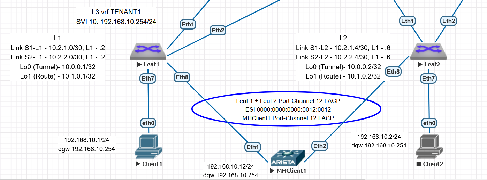

# Домашнее задание 7 (Урок 14)

Для выполнения ДЗ необходимо
- составить план выполнения настройки
- создать конфигурации
- произвести проверку на лабораторном стенде

Выполнение задания сконцентрировано на настройке EVPN ESI, полагаем что ip адресация и интерфейсы уже настроены в ДЗ1 (Урок 3).
Также полагаем Spine, Leaf настроенными на L2VPN из ДЗ5 (Урок 11).
Выбран OSPF Underlay из ДЗ2 (Урок 5).
Выбран eBGP EVPN Overlay ДЗ4 (Урок 8).

Для выполнения ДЗ выбран режим ESI LAG (без MC-LAG).
В качестве Multi-Homing Client выбрана Arista.

## 1. План настройки:
### 1.1. настройка на Leaf локальных параметров - vlan, interface (включая Port-Channel) для подключения конечных клиентских машин
### 1.2. настройка на Leaf локальных параметров - interface Port-Channel параметров - evpn ethernet-segment, lacp system-id
### 1.3. настройка локальных параметров конечных клиентских машин

Схема на основе которой производилась настройка



## 2. Конфигурации, добавляемые в рамках данного ДЗ (остальное взято из ДЗ1)

Логика выбора ethernet-segment будет следующая:
0000:0000:0000:<leaf-pair-number>:<port-channel-number>

Логика выбора LACP system-id будет следующая:
0000.<leaf-pair-number>.<port-channel-number>

=== Leaf1 10.1.0.1

```
interface Ethernet8
   channel-group 12 mode active
!
interface Port-Channel12
   switchport access vlan 10
   !
   evpn ethernet-segment
      identifier 0000:0000:0000:0012:0012
      route-target import 00:00:00:00:12:12
   lacp system-id 0000.0012.0012
!
```

=== Leaf2 10.1.0.2

```
interface Ethernet8
   channel-group 12 mode active
!
interface Port-Channel12
   switchport access vlan 10
   !
   evpn ethernet-segment
      identifier 0000:0000:0000:0012:0012
      route-target import 00:00:00:00:12:12
   lacp system-id 0000.0012.0012
!
```

=== Client1 192.168.10.1

```
ip 192.168.10.1/24 192.168.10.254
save
```

=== MHClient1 192.168.10.12

```
interface Ethernet1
   channel-group 12 mode active
!
interface Ethernet2
   channel-group 12 mode active
!
interface Port-Channel12
   no switchport
   ip address 192.168.10.12/24
!
ip route 0.0.0.0 0.0.0.0 192.168.10.254
```


### 3. Проверка работы

#### 3.1. Проверка работы общая 

Выполняется с помощью ping между Client1 (192.168.10.1) - MHClient1 (192.168.10.12)
Приведены выводы Client1 (VPCS) и MHClient1 (Arista)

Что важно отметить - что Port-Channel LACP на MHClient1 заработал с разными Leaf коммутаторами на другой стороне, причём они не собраны с помощью MC-LAG или Stack технологий. Только ESI EVPN.

~~~
VPCS> ping 192.168.10.12

84 bytes from 192.168.10.12 icmp_seq=1 ttl=64 time=11.624 ms
84 bytes from 192.168.10.12 icmp_seq=2 ttl=64 time=16.873 ms
84 bytes from 192.168.10.12 icmp_seq=3 ttl=64 time=13.118 ms
84 bytes from 192.168.10.12 icmp_seq=4 ttl=64 time=14.451 ms
84 bytes from 192.168.10.12 icmp_seq=5 ttl=64 time=12.114 ms

VPCS> sh arp

50:00:00:af:d3:f6  192.168.10.12 expires in 112 seconds


mhclient1#sh arp
Address         Age (sec)  Hardware Addr   Interface
192.168.10.1      0:19:36  0050.7966.6806  Port-Channel12


mhclient1#sh lacp peer detailed
State: A = Active, P = Passive; S=ShortTimeout, L=LongTimeout;
       G = Aggregable, I = Individual; s+=InSync, s-=OutOfSync;
       C = Collecting (aggregating incoming frames), X = state machine expired,
       D = Distributing (aggregating outgoing frames),
       d = default neighbor state
             |          |                       Partner
Port Status  | Select   | Sys-id                 Port# State   OperKey PortPri
---- --------|----------|----------------------- ----- ------- ------- --------
Port Channel Port-Channel12:
Et1  Bundled | Selected | 8000,00-00-00-12-00-12     8 ALGs+CD  0x000c   32768
Et2  Bundled | Selected | 8000,00-00-00-12-00-12     8 ALGs+CD  0x000c   32768

                         |   Partner    Collector
   Port         Status   |   Churn       MaxDelay
---------- --------------|------------- ---------
Port Channel Port-Channel12:
   Et1          Bundled  |   noChurn            0
   Et2          Bundled  |   noChurn            0


leaf1#sh bgp evpn instance vlan 10
EVPN instance: VLAN 10
  Route distinguisher: 0:0
  Route target import: Route-Target-AS:10:10010
  Route target export: Route-Target-AS:10:10010
  Service interface: VLAN-based
  Local VXLAN IP address: 10.0.0.1
  VXLAN: enabled
  MPLS: disabled
  Local ethernet segment:
    ESI: 0000:0000:0000:0012:0012
      Interface: Port-Channel12
      Mode: all-active
      State: up
      ES-Import RT: 00:00:00:00:12:12
      DF election algorithm: modulus
      Designated forwarder: 10.0.0.1
      Non-Designated forwarder: 10.0.0.2


spine1#sh bgp evpn
BGP routing table information for VRF default
Router identifier 10.1.1.1, local AS number 65000
Route status codes: * - valid, > - active, S - Stale, E - ECMP head, e - ECMP
                    c - Contributing to ECMP, % - Pending BGP convergence
Origin codes: i - IGP, e - EGP, ? - incomplete
AS Path Attributes: Or-ID - Originator ID, C-LST - Cluster List, LL Nexthop - Link Local Nexthop

          Network                Next Hop              Metric  LocPref Weight  Path
 * >      RD: 10.1.0.1:10 auto-discovery 0 0000:0000:0000:0012:0012
                                 10.0.0.1              -       100     0       65001 i
 * >      RD: 10.1.0.2:10 auto-discovery 0 0000:0000:0000:0012:0012
                                 10.0.0.2              -       100     0       65002 i
 * >      RD: 10.0.0.1:1 auto-discovery 0000:0000:0000:0012:0012
                                 10.0.0.1              -       100     0       65001 i
 * >      RD: 10.0.0.2:1 auto-discovery 0000:0000:0000:0012:0012
                                 10.0.0.2              -       100     0       65002 i
 * >      RD: 10.1.0.1:10 mac-ip 0050.7966.6806
                                 10.0.0.1              -       100     0       65001 i
 * >      RD: 10.1.0.1:10 mac-ip 0050.7966.6806 192.168.10.1
                                 10.0.0.1              -       100     0       65001 i
 * >      RD: 10.1.0.1:10 mac-ip 5000.00af.d3f6
                                 10.0.0.1              -       100     0       65001 i
 * >      RD: 10.1.0.1:10 imet 10.0.0.1
                                 10.0.0.1              -       100     0       65001 i
 * >      RD: 10.1.0.2:10 imet 10.0.0.2
                                 10.0.0.2              -       100     0       65002 i
 * >      RD: 10.1.0.3:10 imet 10.0.0.3
                                 10.0.0.3              -       100     0       65003 i
 * >      RD: 10.0.0.1:1 ethernet-segment 0000:0000:0000:0012:0012 10.0.0.1
                                 10.0.0.1              -       100     0       65001 i
 * >      RD: 10.0.0.2:1 ethernet-segment 0000:0000:0000:0012:0012 10.0.0.2
                                 10.0.0.2              -       100     0       65002 i
 * >      RD: 10.1.0.1:20001 ip-prefix 192.168.10.0/24
                                 10.0.0.1              -       100     0       65001 i
 * >      RD: 10.1.0.3:20001 ip-prefix 192.168.20.0/24
                                 10.0.0.3              -       100     0       65003 i

~~~

Замечу что тут вывод содержит "лишние" mac-ip, ip-prefix маршруты, так как остались L2VPN, L3VPN VNI конфигурации.


#### 3.2. Проверка работы при переходных процессах

Ниже проверка работы при выключении-включении линков Leaf1 - Eth8, который по умолчанию становится DF

1. icmp_seq = 5 - потерян при выключении линка Leaf1-Eth8
2. icmp_seq = 10-19 - потеряны при включении линка Leaf1-Eth8.


~~~
VPCS> ping 192.168.10.12 -t

84 bytes from 192.168.10.12 icmp_seq=1 ttl=64 time=13.258 ms
84 bytes from 192.168.10.12 icmp_seq=2 ttl=64 time=12.212 ms
84 bytes from 192.168.10.12 icmp_seq=3 ttl=64 time=12.033 ms
84 bytes from 192.168.10.12 icmp_seq=4 ttl=64 time=14.485 ms
192.168.10.12 icmp_seq=5 timeout
84 bytes from 192.168.10.12 icmp_seq=6 ttl=64 time=82.046 ms
84 bytes from 192.168.10.12 icmp_seq=7 ttl=64 time=127.038 ms
84 bytes from 192.168.10.12 icmp_seq=8 ttl=64 time=40.480 ms
84 bytes from 192.168.10.12 icmp_seq=9 ttl=64 time=50.117 ms
192.168.10.12 icmp_seq=10 timeout
192.168.10.12 icmp_seq=11 timeout
192.168.10.12 icmp_seq=12 timeout
192.168.10.12 icmp_seq=13 timeout
192.168.10.12 icmp_seq=14 timeout
192.168.10.12 icmp_seq=15 timeout
192.168.10.12 icmp_seq=16 timeout
192.168.10.12 icmp_seq=17 timeout
192.168.10.12 icmp_seq=18 timeout
192.168.10.12 icmp_seq=19 timeout
84 bytes from 192.168.10.12 icmp_seq=20 ttl=64 time=25.128 ms
84 bytes from 192.168.10.12 icmp_seq=21 ttl=64 time=21.659 ms
84 bytes from 192.168.10.12 icmp_seq=22 ttl=64 time=25.739 ms
84 bytes from 192.168.10.12 icmp_seq=23 ttl=64 time=13.840 ms
84 bytes from 192.168.10.12 icmp_seq=24 ttl=64 time=16.250 ms

~~~

Ниже проверка работы при выключении-включении линков Leaf2 - Eth8, который по умолчанию не становится DF

1. icmp_seq = 17-26 - потеряны при включении линка Leaf2-Eth8.

~~~
VPCS> ping 192.168.10.12 -t

84 bytes from 192.168.10.12 icmp_seq=1 ttl=64 time=18.513 ms
84 bytes from 192.168.10.12 icmp_seq=2 ttl=64 time=12.986 ms
84 bytes from 192.168.10.12 icmp_seq=3 ttl=64 time=11.903 ms
84 bytes from 192.168.10.12 icmp_seq=4 ttl=64 time=11.842 ms
84 bytes from 192.168.10.12 icmp_seq=5 ttl=64 time=14.012 ms
84 bytes from 192.168.10.12 icmp_seq=6 ttl=64 time=11.879 ms
84 bytes from 192.168.10.12 icmp_seq=7 ttl=64 time=11.707 ms
84 bytes from 192.168.10.12 icmp_seq=8 ttl=64 time=11.869 ms
84 bytes from 192.168.10.12 icmp_seq=9 ttl=64 time=12.917 ms
84 bytes from 192.168.10.12 icmp_seq=10 ttl=64 time=13.510 ms
84 bytes from 192.168.10.12 icmp_seq=11 ttl=64 time=11.881 ms
84 bytes from 192.168.10.12 icmp_seq=12 ttl=64 time=14.127 ms
84 bytes from 192.168.10.12 icmp_seq=13 ttl=64 time=11.642 ms
84 bytes from 192.168.10.12 icmp_seq=14 ttl=64 time=12.575 ms
84 bytes from 192.168.10.12 icmp_seq=15 ttl=64 time=101.222 ms
84 bytes from 192.168.10.12 icmp_seq=16 ttl=64 time=66.413 ms
192.168.10.12 icmp_seq=17 timeout
192.168.10.12 icmp_seq=18 timeout
192.168.10.12 icmp_seq=19 timeout
192.168.10.12 icmp_seq=20 timeout
192.168.10.12 icmp_seq=21 timeout
192.168.10.12 icmp_seq=22 timeout
192.168.10.12 icmp_seq=23 timeout
192.168.10.12 icmp_seq=24 timeout
192.168.10.12 icmp_seq=25 timeout
192.168.10.12 icmp_seq=26 timeout
84 bytes from 192.168.10.12 icmp_seq=27 ttl=64 time=72.750 ms
84 bytes from 192.168.10.12 icmp_seq=28 ttl=64 time=24.663 ms
84 bytes from 192.168.10.12 icmp_seq=29 ttl=64 time=24.009 ms
84 bytes from 192.168.10.12 icmp_seq=30 ttl=64 time=80.072 ms

~~~
