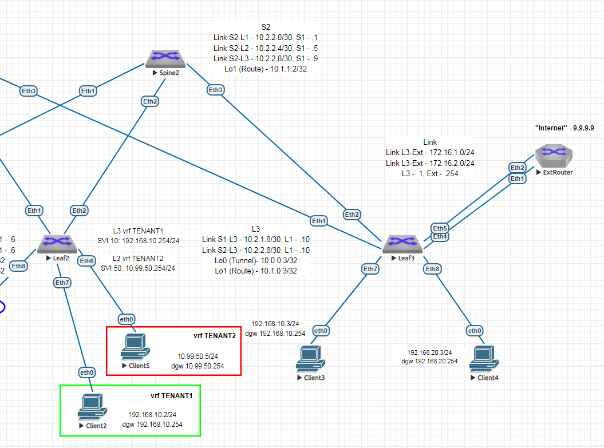

# Домашнее задание 8 (Урок 15)

Для выполнения ДЗ необходимо
- составить план выполнения настройки
- создать конфигурации
- произвести проверку на лабораторном стенде

Выполнение задания сконцентрировано на настройке EVPN Route Type 5, полагаем что ip адресация и интерфейсы уже настроены в ДЗ1 (Урок 3).
Также полагаем Spine, Leaf настроенными на L2VPN, L3VPN из ДЗ5, ДЗ6 (Урок 11 и 12).
Выбран OSPF Underlay из ДЗ2 (Урок 5).
Выбран eBGP EVPN Overlay ДЗ4 (Урок 8).
Для extrouter выбрано анонсирование default-route, aggregate-address (+allowas-in).

Для выполнения ДЗ выбран внешний роутер для имитации внешней маршрутизации (с точки зрения фабрики) и сети Интернет.

## 1. План настройки:
### 1.1. настройка на Leaf локальных параметров - vlan, interface для подключения конечных клиентских машин.
### 1.2. настройка на Leaf локальных параметров - vrf, ip routing vrf, interface в vrf
### 1.3. настройка на Leaf локальных параметров - router bgp, vrf внутри bgp (evpn rd, rt)
### 1.4. настройка на extrouter локальных параметров - interface, router bgp
### 1.5. настройка локальных параметров конечных клиентских машин

Часть схемы на основе которой производилась настройка



## 2. Конфигурации, добавляемые в рамках данного ДЗ (остальное взято из ДЗ 1, 2, 4, 5, 6)

Для проверки взаимодействия между vrf используем машины Client2, Client 5 подключенные в разные vrf (TENANT1, TENANT2)
Для проверки работы "сети Интернет" используем ip.addr 9.9.9.9 на Lo extrouter.


=== Leaf2 10.1.0.2

```
vlan 10,20,50,60
!
vrf instance TENANT1
!
vrf instance TENANT2
!
interface Ethernet6
   switchport access vlan 50
!
interface Ethernet7
   switchport access vlan 10
!
interface Vlan10
   vrf TENANT1
   ip address virtual 192.168.10.254/24
!
interface Vlan50
   vrf TENANT2
   ip address virtual 10.99.50.254/24
!
interface Vlan60
   vrf TENANT2
   ip address virtual 10.99.60.254/24
!
interface Vxlan1
   vxlan vrf TENANT1 vni 20001
   vxlan vrf TENANT2 vni 20002
!
ip virtual-router mac-address 00:00:aa:00:00:02
!
ip routing vrf TENANT1
ip routing vrf TENANT2
!
router bgp 65002
   vrf TENANT1
      rd 10.1.0.2:20001
      route-target import evpn 1:20001
      route-target export evpn 1:20001
      redistribute connected
   !
   vrf TENANT2
      rd 10.1.0.2:20002
      route-target import evpn 2:20002
      route-target export evpn 2:20002
      redistribute connected
```

=== Leaf3 10.1.0.2

```
service routing protocols model multi-agent
!
vrf instance TENANT1
!
vrf instance TENANT2
!
interface Ethernet4
   no switchport
   vrf TENANT1
   ip address 172.16.1.1/24
!
interface Ethernet5
   no switchport
   vrf TENANT2
   ip address 172.16.2.1/24
!
interface Vxlan1
   vxlan vrf TENANT1 vni 20001
   vxlan vrf TENANT2 vni 20002
!
ip virtual-router mac-address 00:00:aa:00:00:03
!
ip routing vrf TENANT1
ip routing vrf TENANT2
!
router bgp 65003
   vrf TENANT1
      rd 10.1.0.3:20001
      route-target import evpn 1:20001
      route-target export evpn 1:20001
      neighbor 172.16.1.254 remote-as 64999
      neighbor 172.16.1.254 allowas-in 3
      redistribute connected
   !
   vrf TENANT2
      rd 10.1.0.3:20002
      route-target import evpn 2:20002
      route-target export evpn 2:20002
      neighbor 172.16.2.254 remote-as 64999
      neighbor 172.16.2.254 allowas-in 3
      redistribute connected

```

=== extrouter 9.9.9.9

```
service routing protocols model multi-agent
!
hostname extrouter
!
interface Ethernet1
   no switchport
   ip address 172.16.1.254/24
!
interface Ethernet2
   no switchport
   ip address 172.16.2.254/24
!
interface Loopback9
   ip address 9.9.9.9/32
!
ip routing
!
ip route 0.0.0.0/0 Null0
!
router bgp 64999
   router-id 9.9.9.9
   timers bgp 3 9
   neighbor FABRIC peer group
   neighbor FABRIC bfd
   neighbor FABRIC ebgp-multihop
   neighbor 172.16.1.1 peer group FABRIC
   neighbor 172.16.1.1 remote-as 65003
   neighbor 172.16.1.1 default-originate
   neighbor 172.16.2.1 peer group FABRIC
   neighbor 172.16.2.1 remote-as 65003
   neighbor 172.16.2.1 default-originate
   aggregate-address 10.99.0.0/16 summary-only
   aggregate-address 192.168.0.0/16 summary-only
   redistribute connected
```

=== Client2 192.168.10.2

```
ip 192.168.10.2/24 192.168.10.254
save
```

=== Client5 10.99.50.5

```
ip 10.99.50.5/24 10.99.50.254
save
```


### 3. Проверка работы

#### 3.1. Проверка работы общая 

Выполняется с помощью ping, trace между Client2 (192.168.10.2) - Client5 (10.99.50.5)
Выполняется с помощью ping, trace между Client2 (192.168.10.2) - extrouter (9.9.9.9)
Приведены выводы Client2 (VPCS)

Что важно отметить - что Port-Channel LACP на MHClient1 заработал с разными Leaf коммутаторами на другой стороне, причём они не собраны с помощью MC-LAG или Stack технологий. Только ESI EVPN.

~~~
VPCS> ping 10.99.50.5

84 bytes from 10.99.50.5 icmp_seq=1 ttl=59 time=69.114 ms
84 bytes from 10.99.50.5 icmp_seq=2 ttl=59 time=64.861 ms
84 bytes from 10.99.50.5 icmp_seq=3 ttl=59 time=78.669 ms
84 bytes from 10.99.50.5 icmp_seq=4 ttl=59 time=91.409 ms
^C
VPCS> ping 9.9.9.9

84 bytes from 9.9.9.9 icmp_seq=1 ttl=62 time=47.383 ms
84 bytes from 9.9.9.9 icmp_seq=2 ttl=62 time=34.522 ms
84 bytes from 9.9.9.9 icmp_seq=3 ttl=62 time=30.237 ms
84 bytes from 9.9.9.9 icmp_seq=4 ttl=62 time=33.011 ms
^C
VPCS> trace 10.99.50.5
trace to 10.99.50.5, 8 hops max, press Ctrl+C to stop
 1   192.168.10.254   6.272 ms  7.455 ms  7.101 ms
 2   192.168.20.254   25.847 ms  24.539 ms  24.607 ms
 3   172.16.1.254   34.786 ms  33.738 ms  36.587 ms
 4   172.16.2.1   37.006 ms  40.195 ms  38.255 ms
 5   10.99.50.254   61.800 ms  58.768 ms  62.140 ms
 6   *10.99.50.5   68.674 ms (ICMP type:3, code:3, Destination port unreachable)

VPCS>


leaf2#sh ip ro vrf TENANT1

VRF: TENANT1
Codes: C - connected, S - static, K - kernel,
       O - OSPF, IA - OSPF inter area, E1 - OSPF external type 1,
       E2 - OSPF external type 2, N1 - OSPF NSSA external type 1,
       N2 - OSPF NSSA external type2, B - Other BGP Routes,
       B I - iBGP, B E - eBGP, R - RIP, I L1 - IS-IS level 1,
       I L2 - IS-IS level 2, O3 - OSPFv3, A B - BGP Aggregate,
       A O - OSPF Summary, NG - Nexthop Group Static Route,
       V - VXLAN Control Service, M - Martian,
       DH - DHCP client installed default route,
       DP - Dynamic Policy Route, L - VRF Leaked,
       G  - gRIBI, RC - Route Cache Route

Gateway of last resort:
 B E      0.0.0.0/0 [200/0] via VTEP 10.0.0.3 VNI 20001 router-mac 50:00:00:15:f4:e8 local-interface Vxlan1
 B E      9.9.9.9/32 [200/0] via VTEP 10.0.0.3 VNI 20001 router-mac 50:00:00:15:f4:e8 local-interface Vxlan1
 B E      172.16.1.0/24 [200/0] via VTEP 10.0.0.3 VNI 20001 router-mac 50:00:00:15:f4:e8 local-interface Vxlan1
 B E      172.16.2.0/24 [200/0] via VTEP 10.0.0.3 VNI 20001 router-mac 50:00:00:15:f4:e8 local-interface Vxlan1
 C        192.168.10.0/24 is directly connected, Vlan10
 B E      192.168.20.0/24 [200/0] via VTEP 10.0.0.3 VNI 20001 router-mac 50:00:00:15:f4:e8 local-interface Vxlan1
 B E      192.168.0.0/16 [200/0] via VTEP 10.0.0.3 VNI 20001 router-mac 50:00:00:15:f4:e8 local-interface Vxlan1

leaf2#
leaf2#sh ip ro vrf TENANT2

VRF: TENANT2
Codes: C - connected, S - static, K - kernel,
       O - OSPF, IA - OSPF inter area, E1 - OSPF external type 1,
       E2 - OSPF external type 2, N1 - OSPF NSSA external type 1,
       N2 - OSPF NSSA external type2, B - Other BGP Routes,
       B I - iBGP, B E - eBGP, R - RIP, I L1 - IS-IS level 1,
       I L2 - IS-IS level 2, O3 - OSPFv3, A B - BGP Aggregate,
       A O - OSPF Summary, NG - Nexthop Group Static Route,
       V - VXLAN Control Service, M - Martian,
       DH - DHCP client installed default route,
       DP - Dynamic Policy Route, L - VRF Leaked,
       G  - gRIBI, RC - Route Cache Route

Gateway of last resort:
 B E      0.0.0.0/0 [200/0] via VTEP 10.0.0.3 VNI 20002 router-mac 50:00:00:15:f4:e8 local-interface Vxlan1
 B E      9.9.9.9/32 [200/0] via VTEP 10.0.0.3 VNI 20002 router-mac 50:00:00:15:f4:e8 local-interface Vxlan1
 C        10.99.50.0/24 is directly connected, Vlan50
 C        10.99.60.0/24 is directly connected, Vlan60
 B E      172.16.1.0/24 [200/0] via VTEP 10.0.0.3 VNI 20002 router-mac 50:00:00:15:f4:e8 local-interface Vxlan1
 B E      172.16.2.0/24 [200/0] via VTEP 10.0.0.3 VNI 20002 router-mac 50:00:00:15:f4:e8 local-interface Vxlan1
 B E      192.168.0.0/16 [200/0] via VTEP 10.0.0.3 VNI 20002 router-mac 50:00:00:15:f4:e8 local-interface Vxlan1


leaf2#sh bgp evpn
BGP routing table information for VRF default
Router identifier 10.1.0.2, local AS number 65002
Route status codes: * - valid, > - active, S - Stale, E - ECMP head, e - ECMP
                    c - Contributing to ECMP, % - Pending BGP convergence
Origin codes: i - IGP, e - EGP, ? - incomplete
AS Path Attributes: Or-ID - Originator ID, C-LST - Cluster List, LL Nexthop - Link Local Nexthop

          Network                Next Hop              Metric  LocPref Weight  Path
 * >Ec    RD: 10.1.0.1:10 imet 10.0.0.1
                                 10.0.0.1              -       100     0       65000 65001 i
 *  ec    RD: 10.1.0.1:10 imet 10.0.0.1
                                 10.0.0.1              -       100     0       65000 65001 i
 * >      RD: 10.1.0.2:10 imet 10.0.0.2
                                 -                     -       -       0       i
 * >Ec    RD: 10.1.0.3:10 imet 10.0.0.3
                                 10.0.0.3              -       100     0       65000 65003 i
 *  ec    RD: 10.1.0.3:10 imet 10.0.0.3
                                 10.0.0.3              -       100     0       65000 65003 i
 * >Ec    RD: 10.1.0.3:20001 ip-prefix 0.0.0.0/0
                                 10.0.0.3              -       100     0       65000 65003 64999 ?
 *  ec    RD: 10.1.0.3:20001 ip-prefix 0.0.0.0/0
                                 10.0.0.3              -       100     0       65000 65003 64999 ?
 * >Ec    RD: 10.1.0.3:20002 ip-prefix 0.0.0.0/0
                                 10.0.0.3              -       100     0       65000 65003 64999 ?
 *  ec    RD: 10.1.0.3:20002 ip-prefix 0.0.0.0/0
                                 10.0.0.3              -       100     0       65000 65003 64999 ?
 * >Ec    RD: 10.1.0.3:20001 ip-prefix 9.9.9.9/32
                                 10.0.0.3              -       100     0       65000 65003 64999 i
 *  ec    RD: 10.1.0.3:20001 ip-prefix 9.9.9.9/32
                                 10.0.0.3              -       100     0       65000 65003 64999 i
 * >Ec    RD: 10.1.0.3:20002 ip-prefix 9.9.9.9/32
                                 10.0.0.3              -       100     0       65000 65003 64999 i
 *  ec    RD: 10.1.0.3:20002 ip-prefix 9.9.9.9/32
                                 10.0.0.3              -       100     0       65000 65003 64999 i
 * >      RD: 10.1.0.2:20002 ip-prefix 10.99.50.0/24
                                 -                     -       -       0       i
 * >      RD: 10.1.0.2:20002 ip-prefix 10.99.60.0/24
                                 -                     -       -       0       i
 * >Ec    RD: 10.1.0.3:20001 ip-prefix 172.16.1.0/24
                                 10.0.0.3              -       100     0       65000 65003 i
 *  ec    RD: 10.1.0.3:20001 ip-prefix 172.16.1.0/24
                                 10.0.0.3              -       100     0       65000 65003 i
 * >Ec    RD: 10.1.0.3:20002 ip-prefix 172.16.1.0/24
                                 10.0.0.3              -       100     0       65000 65003 64999 i
 *  ec    RD: 10.1.0.3:20002 ip-prefix 172.16.1.0/24
                                 10.0.0.3              -       100     0       65000 65003 64999 i
 * >Ec    RD: 10.1.0.3:20001 ip-prefix 172.16.2.0/24
                                 10.0.0.3              -       100     0       65000 65003 64999 i
 *  ec    RD: 10.1.0.3:20001 ip-prefix 172.16.2.0/24
                                 10.0.0.3              -       100     0       65000 65003 64999 i
 * >Ec    RD: 10.1.0.3:20002 ip-prefix 172.16.2.0/24
                                 10.0.0.3              -       100     0       65000 65003 i
 *  ec    RD: 10.1.0.3:20002 ip-prefix 172.16.2.0/24
                                 10.0.0.3              -       100     0       65000 65003 i
 * >Ec    RD: 10.1.0.3:20001 ip-prefix 192.168.0.0/16
                                 10.0.0.3              -       100     0       65000 65003 64999 65003 i
 *  ec    RD: 10.1.0.3:20001 ip-prefix 192.168.0.0/16
                                 10.0.0.3              -       100     0       65000 65003 64999 65003 i
 * >Ec    RD: 10.1.0.3:20002 ip-prefix 192.168.0.0/16
                                 10.0.0.3              -       100     0       65000 65003 64999 65003 i
 *  ec    RD: 10.1.0.3:20002 ip-prefix 192.168.0.0/16
                                 10.0.0.3              -       100     0       65000 65003 64999 65003 i
 * >Ec    RD: 10.1.0.1:20001 ip-prefix 192.168.10.0/24
                                 10.0.0.1              -       100     0       65000 65001 i
 *  ec    RD: 10.1.0.1:20001 ip-prefix 192.168.10.0/24
                                 10.0.0.1              -       100     0       65000 65001 i
 * >      RD: 10.1.0.2:20001 ip-prefix 192.168.10.0/24
                                 -                     -       -       0       i
 * >Ec    RD: 10.1.0.3:20001 ip-prefix 192.168.20.0/24
                                 10.0.0.3              -       100     0       65000 65003 i
 *  ec    RD: 10.1.0.3:20001 ip-prefix 192.168.20.0/24
                                 10.0.0.3              -       100     0       65000 65003 i


~~~
